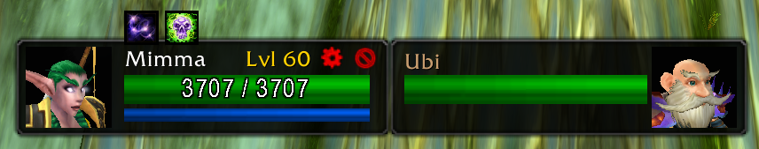

# 🔮 FokusEra

A lightweight, high-performance, and completely standalone focus frame structure built exclusively for **World of Warcraft: Classic Era (Patch 1.15.x)**. 

FokusEra operates entirely on its own visual engine, providing a clean, slate-dark aesthetic without bulky interface overhauls or reliance on external libraries. It bridges the game's background metrics with keyboard action bar macros and provides a dedicated, layout-synchronized **FocusTarget** frame featuring realtime health, mirrored portrait rendering, and intelligent dispel scanning.



---

## 🚀 Quick Start Guide (Get Moving in 10 Seconds)

If you just want to set up your frames and jump straight into a dungeon, use these three absolute core mechanics:

1.  **Set Your Focus** — Select any friendly party or raid member and type **`/fokus`** into your chat.
2.  **Move the Layout** — Ensure your yellow gearwheel icon is unlocked (yellow), then hold **`Alt + Left-Click + Drag`** to reposition either frame independently across your viewport.
3.  **Bind Your Spells** — Type **`/fokusspell [Spell Name]`** (e.g., `/fokusspell Flash Heal`) to instantly bind a click-to-cast action icon directly above your focus frame health bar!

---

## ✨ Features

*   **100% Standalone Integrity** — Operates natively using the Blizzard API without any reliance on or hooks into external unit frame addons. No heavy tracking frameworks to update after game patches.
*   **Symmetrical Dual-Frame Layout** — Includes a primary tracking focus window paired with an advanced, mirrored **FocusTarget** tracker featuring an identical 48-pixel height layout for structural alignment.
*   **Mirrored 3D Portrait Engine** — Primary focus renders portraits on the left side, while the target frame mirrors it perfectly to the right. Equipped with an automated `OnModelLoaded` event to guarantee a seamless close-up camera zoom on every target change.
*   **Intelligent Automated Class Dispel Audit** — Dynamically inspects your active character profile at startup. Borders colorize in real-time according to your class capabilities (e.g., Priests prioritize Magic ➡️ Disease, Shamans prioritize Poison ➡️ Disease) while safely using a zero-nil standard Blizzard fallback for non-healer classes. Only triggers colorizations on the primary Focus frame to keep healing tunnel vision clutter-free.
*   **Direct Raid Target Overlays** — Embeds high-speed index monitors mapping raid symbols (Star, Moon, Skull, etc.) onto synchronized corners of both character portrait boxes.
*   **Clique & Click-Cast Friendly** — Built onto `SecureUnitButtonTemplate` architectures, allowing out-of-combat configuration and full direct binding support via mouseover heal engines like Clique.
*   **Smart Token Routing Loop** — Monitors group re-shuffles and raid grid position re-allocations dynamically in the background 10 times a second, preventing the layout from losing tracking data mid-combat.
*   **Horizontal Stretch Tuning** — Drag the built-in sizing handle in the bottom-right corner to stretch the main frame width dynamically while keeping the 3D portrait size crisp and intact.
*   **Secure Action Button Row** — Embedded 5 horizontal `SecureActionButtonTemplate` slots hovering over the primary health bar profile for safe, chat-driven click-casting.
*   **Persistent WTF Config File Mapping** — Remembers lock states, layout positions, custom coordinate gaps, action bar spell allocations, and expanded widths across relogs uniquely per character.

---

## ⌨️ Slash Commands Overview

Execute these key strings inside your in-game text frame input:

*   `/fokus` — Assigns your currently active friendly target pointer to the framework (Usable out of combat).
*   `/clearfokus` — De-allocates tracking targets, completely conceals active frame structures, and purges system memory keys.
*   `/fokusspell [Spell Name]` — Binds an icon automatically to the next free layout slot (Or use `/fokusspell [1-5] [Name]` for specific cells, or `/fokusspell [1-5]` to clear a slot).
*   `/fokusreset` — Safely flushes runtime coordinates, database entries, and action slots, snapping both frames back to default lower-third grid spaces side by side.
*   `/fokusversion` — Audits active raid or party communication channels for checking matching FokusEra client installations.
*   `/fokushelp` — Prints a layout command cheat sheet checklist index directly into your local log pane.

---

## 📋 Comprehensive Macro Integration

Because FokusEra internally keeps your target updated within a secure framework, you can write powerful companion macros for your keyboard action bars by querying the global frame attributes directly.

### 1. Silent "In-Range Check" Cast Engine (With Icon Tooltip)
```macro
#showtooltip Power Word: Shield
/run local t=FokusEraFrame:GetAttribute("unit"); if t and UnitExists(t) and not UnitIsDeadOrGhost(t) and UnitInRange(t) then CastSpellByName("Power Word: Shield", t); end
```

### 2. Snap-Targeting Pointer Swap
```macro
/run local t=FokusEraFrame:GetAttribute("unit"); if t and UnitExists(t) then TargetUnit(t) end
```

---

## 💽 File Structure Registry

For clean client initialization, your core folder directory path must be named exactly **`fokusera`** inside `World of Warcraft\_classic_era_\Interface\AddOns\`. Ensure your active package includes only the following modules:

1.  **`README.md`** — This structural documentation sheet.
2.  **`CHANGELOG.md`** — Comprehensive release and update changelog history tracking ledger.
3.  **`fokusera.toc`** — The initialization list that loads variables and modules in sequence.
4.  **`fokusinit.lua`** — Initializes shared namespaces and handles system startup variables.
5.  **`fokusui.lua`** — Establishes secure button canvas structures, fonts, backdrops, and resize motors for the main frame.
6.  **`fokustargetui.lua`** — Constructs the mirrored target frame, right-anchored 3D portrait, and magnet-snap alignments.
7.  **`fokusspellbar.lua`** — Manages the 5 horizontal Click-to-Cast action button frames and kulsort spell icons.
8.  **`fokusdispel.lua`** — Audits debuff weight matrices based on active class capabilities to shift backdrop border colors.
9.  **`fokusraidicons.lua`** — Scans and crops real-time raid markers onto corresponding corners of both portraits.
10. **`fokuscore.lua`** — Drives the lightweight background heartbeat update loop, token-remapping, and data-routing.
11. **`fokuschat.lua`** — Binds system commands (`/fokus`, `/fokusreset`, `/fokushelp`) and logs version pings.
12. **`fokusspellcmd.lua`** — Manages data-parsing and spell database scanning triggers for the `/fokusspell` syntax.

---

## 🚀 Post-Installation Verification Checklist

1. Ensure **Clique** is updated to map onto external addons if you want direct mouseover click-casting.
2. Boot into the server environment. Type **`/fokusreset`** to force the layout sandboxes onto your screen (Your system chat frame will confirm authorization with the active version string: **`FokusEra 1.2.2`**).
3. Unlock the yellow wheel icon, adjust your sizing stretch widths, use `/fokusspell` to configure your hot-buttons, and clamp the padlock down red (Locked) to save profiles safely!
